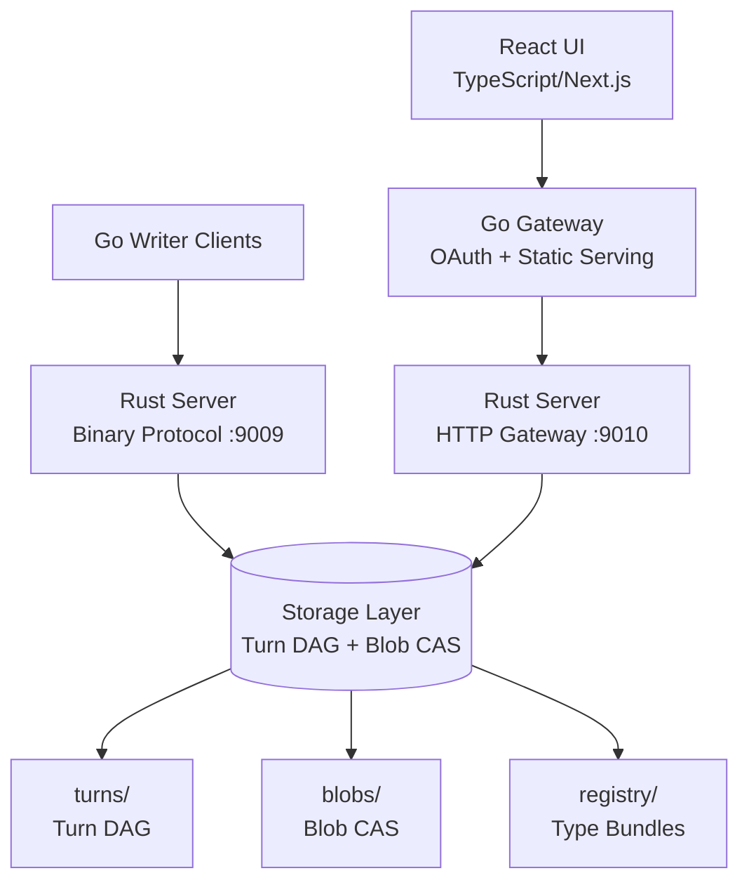
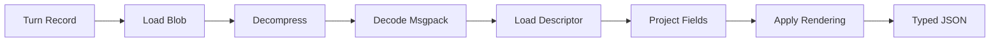

# CXDB Architecture

This document describes the CXDB system architecture, storage model, and design decisions.

## System Overview

CXDB is a three-tier system optimized for append-dominant AI context storage:



### Tiers

**Tier 1: Clients**
- **Go Writers**: High-throughput append clients using binary protocol
- **React UI**: Browser-based visualization and exploration
- **Go Gateway**: OAuth proxy and static file server for production deployments

**Tier 2: Rust Server**
- **Binary Protocol** (`:9009`): Length-prefixed frames for append/read operations
- **HTTP Gateway** (`:9010`): JSON API for typed projections and registry management

**Tier 3: Storage**
- **Turn Store**: Append-only DAG of turn records
- **Blob Store**: Content-addressed storage with deduplication
- **Registry**: Type descriptors for projection

## Storage Architecture

### Turn DAG

Turns form a directed acyclic graph (DAG) where each turn has exactly one parent (or no parent for roots):

```
turn_1 (root, depth=1) → turn_2 (depth=2) → turn_3 (depth=3)
                                           ↘ turn_4 (depth=3, branch)
```

**Turn Record** (fixed-size, 104 bytes):

```rust
TurnRecordV1 {
  turn_id: u64              // Monotonic, globally unique
  parent_turn_id: u64       // 0 for root
  depth: u32                // parent.depth + 1
  codec: u32                // Reserved (unused in v1)
  type_tag: u64             // Reserved (unused in v1)
  payload_hash: [32]u8      // BLAKE3-256
  flags: u32                // Reserved for tombstone/overlay
  created_at_unix_ms: u64   // Timestamp
  crc32: u32                // Checksum
}
```

**Invariants:**
1. `turn_id` is unique and never reused
2. `parent_turn_id` references an earlier turn or is 0
3. `depth` is consistent with parent linkage
4. `payload_hash` references an immutable blob

**Physical Layout:**

```
turns/
├── turns.log      # Append-only turn records (fixed-size)
├── turns.idx      # TurnID → offset index
├── turns.meta     # Declared type + encoding metadata (variable-length)
└── heads.tbl      # Context → head_turn_id mapping (append-only)
```

**Recovery:**
- On startup, scan `turns.log` and `heads.tbl` sequentially
- If a trailing record fails CRC, truncate to last valid position
- Rebuild in-memory index from valid records

### Blob CAS (Content-Addressed Storage)

All turn payloads are stored in a content-addressed blob store keyed by BLAKE3-256 hash.

**Blob Record** (variable-size):

```rust
BlobRecord {
  magic: u32 = 0x42534C42    // 'B''S''L''B'
  version: u16 = 1
  codec: u16                  // 0=none, 1=zstd
  raw_len: u32                // Uncompressed size
  stored_len: u32             // Compressed size
  hash: [32]u8                // BLAKE3-256
  stored_bytes: [stored_len]
  crc32: u32                  // Over header+stored_bytes
}
```

**Index Entry** (fixed-size, 52 bytes):

```rust
BlobIndexEntry {
  hash: [32]u8
  pack_offset: u64
  raw_len: u32
  stored_len: u32
  codec: u16
  reserved: u16
}
```

**Physical Layout:**

```
blobs/
├── blobs.pack     # Append-only blob records
└── blobs.idx      # Hash → offset index (in-memory + file)
```

**Deduplication:**
- Before writing, compute `BLAKE3(uncompressed_bytes)`
- Check index: if hash exists, skip write and return existing entry
- Otherwise, compress with Zstd level 3 and append to pack file
- Update index atomically

**Compression Policy:**
- Compress with Zstd level 3 by default
- If `compressed_size >= raw_size`, store uncompressed (codec=0)
- Small blobs (<128 bytes) are stored uncompressed

### Type Registry

The registry stores type descriptors for projecting msgpack → typed JSON.

**Bundle Format** (JSON):

```json
{
  "registry_version": 1,
  "bundle_id": "2025-01-30T10:00:00Z#abc123",
  "types": {
    "com.example.Message": {
      "versions": {
        "1": {
          "fields": {
            "1": { "name": "role", "type": "string" },
            "2": { "name": "text", "type": "string" }
          }
        }
      }
    }
  }
}
```

**Physical Layout:**

```
registry/
├── bundles/
│   └── {bundle_id}.json
└── index.json      # Latest bundle for each type_id
```

## Protocol Layers

### Binary Protocol (`:9009`)

**Frame Header** (16 bytes):

```rust
FrameHeader {
  len: u32        // Payload length
  msg_type: u16   // Message type code
  flags: u16      // Frame flags
  req_id: u64     // Request ID for multiplexing
}
```

**Message Types:**

| Code | Name | Description |
|------|------|-------------|
| 1 | HELLO | Handshake |
| 2 | CTX_CREATE | Create empty context |
| 3 | CTX_FORK | Fork from existing turn |
| 4 | GET_HEAD | Get current head |
| 5 | APPEND_TURN | Append new turn |
| 6 | GET_LAST | Get last N turns |
| 9 | GET_BLOB | Fetch blob by hash |
| 10 | ATTACH_FS | Attach filesystem tree |
| 11 | PUT_BLOB | Store blob |
| 255 | ERROR | Error response |

See [protocol.md](protocol.md) for wire format details.

### HTTP Gateway (`:9010`)

JSON API for UI and tooling:

- `GET /v1/contexts` - List contexts
- `GET /v1/contexts/:id/turns` - Get turns (with projection)
- `POST /v1/contexts/create` - Create context
- `POST /v1/contexts/:id/append` - Append turn
- `PUT /v1/registry/bundles/:id` - Publish type bundle

See [http-api.md](http-api.md) for complete reference.

## Projection Pipeline

When a client requests typed JSON (`view=typed`), the server:

1. **Fetch Turn**: Load turn record from `turns.log` + metadata from `turns.meta`
2. **Load Blob**: Fetch payload bytes from blob store using `payload_hash`
3. **Decompress**: If blob is compressed, decompress with Zstd
4. **Decode Msgpack**: Parse msgpack map with numeric keys
5. **Load Descriptor**: Fetch type descriptor for `type_id:type_version` from registry
6. **Project Fields**: Map numeric tags → field names using descriptor
7. **Apply Rendering**: Convert u64→string, bytes→base64, enums→labels
8. **Return JSON**: Serialize to JSON with `data` and optional `unknown` fields



**Rendering Options:**

- `u64_format=string|number` - Large integers as strings (default: string)
- `bytes_render=base64|hex|len_only` - Binary data encoding (default: base64)
- `enum_render=label|number|both` - Enum display (default: label)
- `time_render=iso|unix_ms` - Timestamp format (default: iso)

## Concurrency Model

**TurnID Allocation:**
- Single global atomic counter
- Linearizable: each turn gets a unique, monotonic ID

**Per-Context Head Updates:**
- Per-context mutex guards head pointer updates
- Append operations are serialized per context
- Different contexts can append concurrently

**Blob Deduplication:**
- Index sharded by hash prefix (16 shards)
- Double-checked locking: check index, lock shard, check again, write if missing

**Example Concurrency:**

```
Thread 1: Append to context 1 → acquire lock(ctx1) → write turn → update head → release
Thread 2: Append to context 2 → acquire lock(ctx2) → write turn → update head → release
Thread 3: Append to context 1 → wait for lock(ctx1) → write turn → update head → release
```

Blobs are deduplicated safely under contention:

```
Thread A: hash=abc → check index (miss) → lock shard(abc) → check again → write → unlock
Thread B: hash=abc → check index (hit from Thread A) → return existing entry
```

## Performance Characteristics

**Append Turn** (10KB payload):
- Compute BLAKE3: ~0.5ms
- Blob dedup check: O(1) hash lookup, ~0.01ms
- Compress (if new): ~0.5ms
- Write turn record: ~0.1ms
- Update head: ~0.1ms
- **Total: ~1ms p50, ~10ms p99**

**Get Last N**:
- Walk N parents from head: O(N)
- Load blobs: O(N) hash lookups + decompression
- Decompress (Zstd): ~0.5ms per 10KB blob
- **Total: ~1ms for N=10 (warm cache)**

**Projection** (per turn):
- Msgpack decode: ~0.1ms
- Registry lookup: O(1) in-memory
- Field projection: O(fields)
- **Total: ~0.2ms per turn**

**Storage Efficiency:**
- Turn record: 104 bytes
- Turn metadata: ~50 bytes (type_id + encoding)
- Blob overhead: ~50 bytes (header + CRC)
- Typical 10KB payload compresses to ~3KB (70% reduction)
- **Total: ~3.2KB per 10KB turn**

**Deduplication Savings:**
- Identical payloads: 0 additional storage
- Example: 1000 turns with 50% duplicate content → 50% storage savings

## Design Decisions

### Why BLAKE3?

- **Fast**: 3-4x faster than SHA-256 on modern CPUs
- **Secure**: 256-bit output, collision-resistant
- **Deterministic**: Same input → same hash (critical for dedup)

### Why Msgpack with Numeric Tags?

- **Dense**: Smaller than JSON (no field names repeated)
- **Forward-compatible**: Unknown tags preserved
- **Fast**: Faster to parse than JSON
- **Numeric tags**: Never reused, safe for schema evolution

### Why Zstd Level 3?

- **Fast**: 10x faster compression than gzip -6
- **Good ratio**: ~70% size reduction on JSON-like data
- **Streaming-friendly**: Can compress/decompress incrementally

### Why Append-Only?

- **Crash-safe**: Partial writes don't corrupt earlier data
- **Fast**: No seeks, pure sequential writes (~500 MB/s on SSD)
- **Simple recovery**: Scan forward, truncate to last valid CRC

### Why Per-Context Locks?

- **Scalability**: N contexts can append concurrently
- **Correctness**: Head updates are linearizable per context
- **Simple**: No complex MVCC or optimistic concurrency

## Scalability Limits (v1)

**Single-process:**
- **Contexts**: Millions (limited by 64-bit ID space)
- **Turns**: Billions (limited by 64-bit ID space and disk)
- **Concurrent appends**: ~10,000/sec (single process, SSD)
- **Storage**: Limited by disk size (~1GB per 300K turns with 10KB payloads)

**Not supported in v1:**
- Distributed/replicated storage
- Horizontal read scaling (single reader process)
- Sub-blob chunking for huge payloads (>1MB)

See [Roadmap](https://github.com/strongdm/cxdb/blob/main/ROADMAP.md) for v2 features.

## Filesystem Layout

```
data/
├── blobs/
│   ├── blobs.pack          # Append-only blob records
│   └── blobs.idx           # Hash → offset index
├── turns/
│   ├── turns.log           # Append-only turn records
│   ├── turns.idx           # TurnID → offset index
│   ├── turns.meta          # Type + encoding metadata
│   └── heads.tbl           # Context → head mapping
├── registry/
│   ├── bundles/
│   │   └── {bundle_id}.json
│   └── index.json
└── fs_trees/               # Optional: filesystem snapshots
    └── {tree_hash}/
```

## Observability

**Metrics** (Prometheus format on `:9011`):
- `cxdb_turns_total` - Total turns appended
- `cxdb_blobs_total` - Total blobs stored
- `cxdb_blob_dedup_hits` - Deduplication hits
- `cxdb_append_duration_seconds` - Append latency histogram
- `cxdb_storage_bytes` - Total storage used

**Logs** (structured JSON):
- `CXDB_LOG_LEVEL=debug` for detailed tracing
- Request/response logging
- Error stack traces

See [troubleshooting.md](troubleshooting.md) for debugging.

## Security Considerations

**Authentication:**
- Binary protocol (`:9009`) has no built-in auth (use TLS + firewall)
- HTTP gateway (`:9010`) delegates auth to Go gateway (OAuth)

**Authorization:**
- Single-tenant model (no per-context ACLs in v1)
- Trust all authenticated clients

**Content:**
- No payload inspection or sanitization
- Clients responsible for input validation
- Stored blobs are opaque bytes

**Network:**
- Use TLS for production deployments
- Restrict binary protocol to trusted networks
- HTTP gateway should run behind OAuth proxy

See [deployment.md](deployment.md) for production setup.
