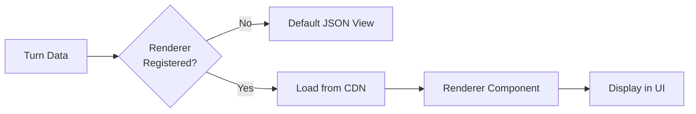

# Renderers

Renderers are JavaScript modules that provide custom visualizations for turn payloads in the CXDB UI.

## Overview

When displaying a turn, the UI:

1. Checks if a renderer is registered for the turn's `type_id`
2. If found, loads the renderer module (ESM from CDN)
3. Passes the typed JSON data to the renderer component
4. Renders the output in the turn card



## Renderer Registration

Renderers are configured in the UI settings:

```typescript
// frontend/lib/renderers.ts
export const renderers: RendererConfig[] = [
  {
    type_id: 'com.example.Chart',
    renderer_url: 'https://cdn.example.com/renderers/chart@1.0.0.js',
    name: 'Chart Renderer',
    version: '1.0.0'
  },
  {
    type_id: 'com.example.Image',
    renderer_url: 'https://cdn.example.com/renderers/image@1.0.0.js',
    name: 'Image Renderer',
    version: '1.0.0'
  }
];
```

## Renderer API

A renderer is an ES module that exports a default React component:

```javascript
// chart-renderer.js
export default function ChartRenderer({ data, metadata }) {
  return (
    <div className="chart-container">
      <h3>{data.title}</h3>
      <LineChart points={data.points} />
    </div>
  );
}
```

### Props

Renderers receive these props:

```typescript
interface RendererProps {
  // Typed turn data (projected from msgpack)
  data: any;

  // Turn metadata
  metadata: {
    turn_id: string;
    depth: number;
    declared_type: {
      type_id: string;
      type_version: number;
    };
  };

  // UI theme
  theme: 'light' | 'dark';

  // Callbacks
  onError?: (error: Error) => void;
}
```

### Return Value

The component should return valid React elements (JSX).

## Simple Example: Image Renderer

```javascript
// image-renderer.js
export default function ImageRenderer({ data, metadata }) {
  // data = { alt: "Diagram", bytes: "base64..." }

  return (
    <figure>
      
      {data.alt && <figcaption>{data.alt}</figcaption>}
    </figure>
  );
}
```

**Type descriptor:**

```json
{
  "com.example.Image": {
    "versions": {
      "1": {
        "fields": {
          "1": { "name": "alt", "type": "string", "optional": true },
          "2": { "name": "bytes", "type": "bytes" }
        }
      }
    }
  }
}
```

**Projection:** (with `bytes_render=base64`)

```json
{
  "alt": "Architecture diagram",
  "bytes": "iVBORw0KGgoAAAANSUhEUgAA..."
}
```

## Advanced Example: Chart Renderer

```javascript
// chart-renderer.js
import React from 'react';

export default function ChartRenderer({ data, theme }) {
  const { title, points } = data;

  const maxY = Math.max(...points.map(p => p.y));
  const scale = 200 / maxY;

  return (
    <div style={{
      background: theme === 'dark' ? '#1a1a1a' : '#f5f5f5',
      padding: '1rem',
      borderRadius: '8px'
    }}>
      <h3>{title}</h3>
      <svg width="400" height="200" viewBox="0 0 400 200">
        <polyline
          points={points.map((p, i) =>
            `${i * (400 / points.length)},${200 - p.y * scale}`
          ).join(' ')}
          fill="none"
          stroke={theme === 'dark' ? '#00ff00' : '#0066cc'}
          strokeWidth="2"
        />
      </svg>
    </div>
  );
}
```

**Type descriptor:**

```json
{
  "com.example.Chart": {
    "versions": {
      "1": {
        "fields": {
          "1": { "name": "title", "type": "string" },
          "2": { "name": "points", "type": "array", "items": "nested", "nested": "com.example.Point" }
        }
      }
    }
  },
  "com.example.Point": {
    "versions": {
      "1": {
        "fields": {
          "1": { "name": "x", "type": "f64" },
          "2": { "name": "y", "type": "f64" }
        }
      }
    }
  }
}
```

## Using External Libraries

Renderers can import libraries from CDNs:

```javascript
// chart-renderer-with-recharts.js
import React from 'react';
import { LineChart, Line, XAxis, YAxis, CartesianGrid, Tooltip } from 'https://esm.sh/recharts@2.10.0';

export default function ChartRenderer({ data }) {
  return (
    <LineChart width={600} height={300} data={data.points}>
      <CartesianGrid strokeDasharray="3 3" />
      <XAxis dataKey="x" />
      <YAxis />
      <Tooltip />
      <Line type="monotone" dataKey="y" stroke="#8884d8" />
    </LineChart>
  );
}
```

**Supported CDNs:**
- esm.sh (recommended)
- unpkg.com
- cdn.jsdelivr.net
- skypack.dev

**Note:** Configure allowed CDNs via `ALLOWED_RENDERER_ORIGINS` in the gateway.

## Building Renderers

### Using Vite

```bash
mkdir my-renderer
cd my-renderer
npm init -y
npm install vite react
```

**vite.config.js:**

```javascript
import { defineConfig } from 'vite';

export default defineConfig({
  build: {
    lib: {
      entry: 'src/index.jsx',
      formats: ['es'],
      fileName: 'renderer'
    },
    rollupOptions: {
      external: ['react', 'react/jsx-runtime'],
      output: {
        globals: {
          react: 'React'
        }
      }
    }
  }
});
```

**src/index.jsx:**

```javascript
import React from 'react';

export default function MyRenderer({ data }) {
  return <div>{data.message}</div>;
}
```

**Build:**

```bash
npm run build
# Output: dist/renderer.js
```

### Using esbuild

```bash
npm install esbuild
```

**build.js:**

```javascript
import esbuild from 'esbuild';

esbuild.build({
  entryPoints: ['src/index.jsx'],
  bundle: true,
  format: 'esm',
  outfile: 'dist/renderer.js',
  external: ['react'],
  jsx: 'automatic'
});
```

## Self-Hosting Renderers

Upload your built renderer to a CDN or static host:

```bash
# AWS S3
aws s3 cp dist/renderer.js s3://my-bucket/renderers/my-renderer@1.0.0.js
aws s3api put-object-acl --bucket my-bucket --key renderers/my-renderer@1.0.0.js --acl public-read

# Cloudflare Pages
npx wrangler pages publish dist

# GitHub Pages
cp dist/renderer.js docs/renderers/my-renderer@1.0.0.js
git add docs && git commit -m "Add renderer" && git push
```

Then register it:

```typescript
{
  type_id: 'com.mycompany.MyType',
  renderer_url: 'https://my-bucket.s3.amazonaws.com/renderers/my-renderer@1.0.0.js',
  name: 'My Custom Renderer',
  version: '1.0.0'
}
```

## Security

### Content Security Policy (CSP)

The CXDB gateway sets CSP headers to restrict renderer origins:

```
Content-Security-Policy: script-src 'self' https://cdn.strongdm.ai https://esm.sh https://unpkg.com
```

**Configuring Allowed Origins:**

```bash
# gateway/.env
ALLOWED_RENDERER_ORIGINS=https://cdn.strongdm.ai,https://your-cdn.com
```

### Sandboxing

Renderers run in the same browser context as the UI. Follow these best practices:

1. **Validate input data**
   ```javascript
   export default function MyRenderer({ data }) {
     if (!data || typeof data.message !== 'string') {
       return <div>Invalid data</div>;
     }
     // ...
   }
   ```

2. **Sanitize HTML**
   ```javascript
   import DOMPurify from 'https://esm.sh/dompurify@3.0.0';

   export default function HTMLRenderer({ data }) {
     const clean = DOMPurify.sanitize(data.html);
     return <div dangerouslySetInnerHTML={{ __html: clean }} />;
   }
   ```

3. **Avoid eval and Function**
   - Never use `eval()` or `new Function()`
   - Don't execute code from turn data

4. **Limit network access**
   - Don't make arbitrary fetch() requests
   - Only load assets from whitelisted CDNs

## Error Handling

Wrap your renderer in error boundaries:

```javascript
import React from 'react';

class ErrorBoundary extends React.Component {
  state = { error: null };

  static getDerivedStateFromError(error) {
    return { error };
  }

  render() {
    if (this.state.error) {
      return (
        <div style={{ color: 'red', padding: '1rem' }}>
          Renderer error: {this.state.error.message}
        </div>
      );
    }
    return this.props.children;
  }
}

export default function SafeRenderer({ data, onError }) {
  try {
    return (
      <ErrorBoundary>
        <MyActualRenderer data={data} />
      </ErrorBoundary>
    );
  } catch (err) {
    onError?.(err);
    return <div>Render failed</div>;
  }
}
```

## Testing Renderers

### Local Testing

Create a test harness:

```html
<!-- test.html -->
<!DOCTYPE html>
<html>
<head>
  <script type="importmap">
    {
      "imports": {
        "react": "https://esm.sh/react@18",
        "react/jsx-runtime": "https://esm.sh/react@18/jsx-runtime"
      }
    }
  </script>
</head>
<body>
  <div id="root"></div>
  <script type="module">
    import React from 'react';
    import { createRoot } from 'https://esm.sh/react-dom@18/client';
    import Renderer from './dist/renderer.js';

    const root = createRoot(document.getElementById('root'));
    root.render(
      React.createElement(Renderer, {
        data: {
          message: 'Test data'
        },
        metadata: {
          turn_id: '1',
          depth: 1,
          declared_type: {
            type_id: 'com.example.Test',
            type_version: 1
          }
        },
        theme: 'light'
      })
    );
  </script>
</body>
</html>
```

Serve locally:

```bash
python3 -m http.server 8000
# Open http://localhost:8000/test.html
```

### Unit Tests

```javascript
// renderer.test.jsx
import { render, screen } from '@testing-library/react';
import Renderer from './renderer';

test('renders message', () => {
  const data = { message: 'Hello' };
  render(<Renderer data={data} metadata={{}} theme="light" />);
  expect(screen.getByText('Hello')).toBeInTheDocument();
});
```

## Renderer Registry

For organizations with many custom renderers, create a registry service:

**registry.json:**

```json
{
  "renderers": [
    {
      "type_id": "com.example.Chart",
      "url": "https://cdn.example.com/renderers/chart@1.2.0.js",
      "version": "1.2.0",
      "checksum": "sha256-abc123..."
    },
    {
      "type_id": "com.example.Image",
      "url": "https://cdn.example.com/renderers/image@1.0.0.js",
      "version": "1.0.0",
      "checksum": "sha256-def456..."
    }
  ]
}
```

Load dynamically in the UI:

```typescript
// frontend/lib/renderers.ts
export async function loadRendererRegistry() {
  const response = await fetch('https://cdn.example.com/registry.json');
  const registry = await response.json();
  return registry.renderers;
}
```

## Examples Repository

See the [cxdb-renderers](https://github.com/strongdm/cxdb-renderers) repository for example renderers:

- **Markdown** - Rendered markdown with syntax highlighting
- **Mermaid** - Diagram rendering
- **Code** - Syntax-highlighted code blocks
- **Table** - Sortable, filterable tables
- **JSON** - Pretty-printed JSON with collapsible sections
- **Diff** - Side-by-side diff viewer

## Performance Tips

1. **Lazy load heavy dependencies**
   ```javascript
   const Chart = lazy(() => import('https://esm.sh/recharts@2.10.0'));

   export default function MyRenderer({ data }) {
     return (
       <Suspense fallback={<div>Loading chart...</div>}>
         <Chart data={data} />
       </Suspense>
     );
   }
   ```

2. **Memoize expensive computations**
   ```javascript
   const processedData = useMemo(() => {
     return data.points.map(p => ({ ...p, y: p.y * 100 }));
   }, [data.points]);
   ```

3. **Virtualize large lists**
   ```javascript
   import { FixedSizeList } from 'https://esm.sh/react-window@1.8.10';

   export default function ListRenderer({ data }) {
     return (
       <FixedSizeList
         height={400}
         itemCount={data.items.length}
         itemSize={50}
       >
         {({ index, style }) => (
           <div style={style}>{data.items[index]}</div>
         )}
       </FixedSizeList>
     );
   }
   ```

## Troubleshooting

### Renderer not loading

**Symptoms:** Turn shows "Renderer not found" or default JSON view

**Solutions:**
1. Check that `type_id` matches exactly (case-sensitive)
2. Verify renderer URL is accessible (try in browser)
3. Check browser console for CORS or CSP errors
4. Ensure renderer exports a default function

### CSP blocks renderer

**Symptoms:** Console error: "Refused to load script from..."

**Solution:** Add renderer CDN to `ALLOWED_RENDERER_ORIGINS`:

```bash
ALLOWED_RENDERER_ORIGINS=https://cdn.strongdm.ai,https://your-cdn.com
```

### Renderer crashes

**Symptoms:** "Something went wrong" error in turn card

**Solutions:**
1. Check browser console for error details
2. Add error boundary to renderer
3. Validate input data shape
4. Test with sample data locally

### Import errors

**Symptoms:** "Failed to resolve module"

**Solutions:**
1. Use full URLs with https:// protocol
2. Use ESM-compatible CDN (esm.sh, skypack)
3. Check library is available as ESM
4. Externalize React: `external: ['react']`

## See Also

- [Type Registry](type-registry.md) - Defining turn types
- [HTTP API](http-api.md) - Fetching turns with projections
- [Architecture](architecture.md) - Projection pipeline
- [Example Renderers](https://github.com/strongdm/cxdb-renderers) - Sample renderer implementations
