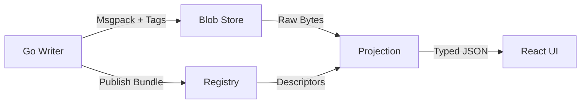

# Type Registry

The type registry enables forward-compatible schema evolution and typed JSON projections for CXDB payloads.

## Overview

CXDB stores turn payloads as **msgpack with numeric field tags**. The type registry provides:

1. **Type definitions**: Mapping numeric tags → field names and types
2. **Schema evolution**: Adding fields without breaking old readers
3. **Typed projections**: Converting msgpack → JSON with proper type coercion
4. **Version tracking**: Multiple versions of the same type coexist



## Core Concepts

### Type ID

A stable, globally unique string identifier for a type:

```
com.example.Message
com.example.ToolCall
com.yourorg.ai.ImageAttachment
```

**Rules:**
- Reverse-domain notation recommended
- Never reuse a type ID
- Case-sensitive

### Type Version

A monotonically increasing `u32` per type ID:

```
com.example.Message v1 → v2 → v3
```

**Rules:**
- Start at 1
- Increment on any descriptor change (even renaming fields)
- Never skip versions

### Field Tags

Numeric identifiers for struct fields:

```go
type Message struct {
    Role string `msgpack:"1"`  // Tag 1
    Text string `msgpack:"2"`  // Tag 2
}
```

**Rules:**
- Use positive integers (1, 2, 3, ...)
- Never reuse a tag within a type
- Tags are immutable once assigned
- No gaps required (1, 2, 3 or 1, 5, 10 both valid)

## Registry Bundle Format

A bundle is a JSON document describing types and versions:

```json
{
  "registry_version": 1,
  "bundle_id": "2025-01-30T10:00:00Z#abc123",
  "types": {
    "com.example.Message": {
      "versions": {
        "1": {
          "fields": {
            "1": { "name": "role", "type": "string" },
            "2": { "name": "text", "type": "string", "optional": true }
          }
        }
      }
    }
  },
  "enums": {
    "com.example.Role": {
      "1": "system",
      "2": "user",
      "3": "assistant",
      "4": "tool"
    }
  }
}
```

### Field Descriptors

Each field has:

| Property | Type | Required | Description |
|----------|------|----------|-------------|
| `name` | string | Yes | Field name in JSON projection |
| `type` | string | Yes | Field type (see types below) |
| `optional` | bool | No | Field may be missing (default: false) |
| `semantic` | string | No | Semantic hint (e.g., `unix_ms` for timestamps) |
| `enum` | string | No | Enum type reference |
| `items` | string | No | Array item type |
| `nested` | string | No | Nested type reference |

### Supported Types

**Scalars:**
- `bool`
- `i8`, `i16`, `i32`, `i64`
- `u8`, `u16`, `u32`, `u64`
- `f32`, `f64`
- `string`
- `bytes`

**Containers:**
- `array` (requires `items`)
- `map` (requires `key_type` and `value_type`)

**Special:**
- `typed_blob` (nested type with `type_id` and `type_version` discriminator)

### Semantic Hints

Provide rendering hints for projection:

| Semantic | Type | Rendering |
|----------|------|-----------|
| `unix_ms` | u64 | ISO-8601 timestamp |
| `unix_sec` | u64 | ISO-8601 timestamp |
| `duration_ms` | u64 | Human-readable duration |
| `url` | string | Clickable link |
| `markdown` | string | Rendered markdown |

**Example:**

```json
{
  "3": {
    "name": "timestamp",
    "type": "u64",
    "semantic": "unix_ms"
  }
}
```

Projection:

```json
{
  "timestamp": "2025-01-30T10:00:00.000Z"
}
```

## Schema Evolution

### Adding a Field (Safe)

**Version 1:**

```go
type Message struct {
    Role string `msgpack:"1"`
    Text string `msgpack:"2"`
}
```

**Version 2:** (add attachments)

```go
type Message struct {
    Role        string   `msgpack:"1"`
    Text        string   `msgpack:"2"`
    Attachments [][]byte `msgpack:"3"` // New field
}
```

**Registry:**

```json
{
  "types": {
    "com.example.Message": {
      "versions": {
        "1": {
          "fields": {
            "1": { "name": "role", "type": "string" },
            "2": { "name": "text", "type": "string" }
          }
        },
        "2": {
          "fields": {
            "1": { "name": "role", "type": "string" },
            "2": { "name": "text", "type": "string" },
            "3": { "name": "attachments", "type": "array", "items": "bytes", "optional": true }
          }
        }
      }
    }
  }
}
```

**Compatibility:**
- Old readers (v1) ignore tag 3 (unknown field)
- New readers (v2) handle missing tag 3 as `null` or empty array

### Changing a Field Type (Unsafe - Use New Tag)

**Wrong:**

```diff
- "2": { "name": "text", "type": "string" }
+ "2": { "name": "text", "type": "bytes" }  // WRONG: breaks old readers
```

**Correct:**

```go
type Message struct {
    Role      string `msgpack:"1"`
    // Text   string `msgpack:"2"`  // Deprecated
    TextBytes []byte `msgpack:"4"`  // New tag
}
```

**Registry:**

```json
{
  "versions": {
    "2": {
      "fields": {
        "1": { "name": "role", "type": "string" },
        "2": { "name": "text_deprecated", "type": "string", "optional": true },
        "4": { "name": "text", "type": "bytes" }
      }
    }
  }
}
```

### Renaming a Field (Safe - Descriptor Only)

Renaming only affects the JSON projection, not the wire format:

```diff
- "2": { "name": "text", "type": "string" }
+ "2": { "name": "content", "type": "string" }  // Safe: tag unchanged
```

Increment the version number to signal the change.

### Removing a Field (Safe - Mark Deprecated)

**Version 1:**

```json
{
  "1": { "name": "role", "type": "string" },
  "2": { "name": "text", "type": "string" },
  "3": { "name": "debug_info", "type": "string" }
}
```

**Version 2:** (remove debug_info)

```json
{
  "1": { "name": "role", "type": "string" },
  "2": { "name": "text", "type": "string" }
  // Tag 3 not listed - preserved as unknown field
}
```

Old payloads with tag 3 will have it in the `unknown` object (if `include_unknown=1`).

## Publishing Bundles

### From Go

```go
import (
    "bytes"
    "encoding/json"
    "net/http"
)

bundle := map[string]interface{}{
    "registry_version": 1,
    "bundle_id": "2025-01-30T10:00:00Z#abc123",
    "types": map[string]interface{}{
        "com.example.Message": map[string]interface{}{
            "versions": map[string]interface{}{
                "1": map[string]interface{}{
                    "fields": map[string]interface{}{
                        "1": map[string]interface{}{"name": "role", "type": "string"},
                        "2": map[string]interface{}{"name": "text", "type": "string"},
                    },
                },
            },
        },
    },
}

data, _ := json.Marshal(bundle)

resp, err := http.Put(
    "http://localhost:9010/v1/registry/bundles/2025-01-30T10:00:00Z",
    bytes.NewReader(data),
)
```

### From CLI

```bash
curl -X PUT http://localhost:9010/v1/registry/bundles/2025-01-30T10:00:00Z \
  -H "Content-Type: application/json" \
  -d @registry-bundle.json
```

**registry-bundle.json:**

```json
{
  "registry_version": 1,
  "bundle_id": "2025-01-30T10:00:00Z",
  "types": { ... }
}
```

## Example: Message Type with Evolution

### Version 1 (Initial)

```go
type Message struct {
    Role string `msgpack:"1"`
    Text string `msgpack:"2"`
}
```

```json
{
  "com.example.Message": {
    "versions": {
      "1": {
        "fields": {
          "1": { "name": "role", "type": "string" },
          "2": { "name": "text", "type": "string" }
        }
      }
    }
  }
}
```

### Version 2 (Add Timestamp)

```go
type Message struct {
    Role      string `msgpack:"1"`
    Text      string `msgpack:"2"`
    Timestamp uint64 `msgpack:"3"` // unix milliseconds
}
```

```json
{
  "com.example.Message": {
    "versions": {
      "1": { ... },
      "2": {
        "fields": {
          "1": { "name": "role", "type": "string" },
          "2": { "name": "text", "type": "string" },
          "3": { "name": "timestamp", "type": "u64", "semantic": "unix_ms", "optional": true }
        }
      }
    }
  }
}
```

### Version 3 (Add Attachments)

```go
type Message struct {
    Role        string   `msgpack:"1"`
    Text        string   `msgpack:"2"`
    Timestamp   uint64   `msgpack:"3"`
    Attachments [][]byte `msgpack:"4"`
}
```

```json
{
  "com.example.Message": {
    "versions": {
      "1": { ... },
      "2": { ... },
      "3": {
        "fields": {
          "1": { "name": "role", "type": "string" },
          "2": { "name": "text", "type": "string" },
          "3": { "name": "timestamp", "type": "u64", "semantic": "unix_ms", "optional": true },
          "4": { "name": "attachments", "type": "array", "items": "bytes", "optional": true }
        }
      }
    }
  }
}
```

## Projection Examples

### Basic Projection

**Msgpack (hex):**

```
82 01 a4 75 73 65 72 02 aa 48 65 6c 6c 6f 20 74 68 65 72 65
```

Decoded: `{1: "user", 2: "Hello there"}`

**With Descriptor:**

```json
{
  "1": { "name": "role", "type": "string" },
  "2": { "name": "text", "type": "string" }
}
```

**Projected JSON:**

```json
{
  "role": "user",
  "text": "Hello there"
}
```

### With Unknown Fields

**Msgpack:** `{1: "user", 2: "Hello", 99: 42}`

**Descriptor:** (only tags 1 and 2)

**Projected JSON (`include_unknown=1`):**

```json
{
  "role": "user",
  "text": "Hello",
  "unknown": {
    "99": 42
  }
}
```

### Timestamp Rendering

**Msgpack:** `{1: "user", 3: 1706615000000}`

**Descriptor:**

```json
{
  "1": { "name": "role", "type": "string" },
  "3": { "name": "timestamp", "type": "u64", "semantic": "unix_ms" }
}
```

**Projected JSON (`time_render=iso`):**

```json
{
  "role": "user",
  "timestamp": "2025-01-30T10:10:00.000Z"
}
```

**Projected JSON (`time_render=unix_ms`):**

```json
{
  "role": "user",
  "timestamp": 1706615000000
}
```

### Bytes Rendering

**Msgpack:** `{1: "user", 4: [0x89, 0x50, 0x4e, 0x47]}`

**Descriptor:**

```json
{
  "1": { "name": "role", "type": "string" },
  "4": { "name": "image", "type": "bytes" }
}
```

**Projected JSON (`bytes_render=base64`):**

```json
{
  "role": "user",
  "image": "iVBORw..."
}
```

**Projected JSON (`bytes_render=len_only`):**

```json
{
  "role": "user",
  "image": "<4 bytes>"
}
```

## Nested Types

For complex nested structures:

```go
type ToolCall struct {
    Name      string                 `msgpack:"1"`
    Arguments map[string]interface{} `msgpack:"2"`
}

type Message struct {
    Role     string     `msgpack:"1"`
    Text     string     `msgpack:"2"`
    ToolCall *ToolCall  `msgpack:"3"`
}
```

**Registry:**

```json
{
  "types": {
    "com.example.ToolCall": {
      "versions": {
        "1": {
          "fields": {
            "1": { "name": "name", "type": "string" },
            "2": { "name": "arguments", "type": "map", "key_type": "string", "value_type": "any" }
          }
        }
      }
    },
    "com.example.Message": {
      "versions": {
        "1": {
          "fields": {
            "1": { "name": "role", "type": "string" },
            "2": { "name": "text", "type": "string" },
            "3": { "name": "tool_call", "type": "nested", "nested": "com.example.ToolCall", "optional": true }
          }
        }
      }
    }
  }
}
```

## Best Practices

1. **Publish bundles before writing turns**
   - Server can project turns immediately
   - Avoids "type not found" errors

2. **Use reverse-domain type IDs**
   - `com.yourcompany.product.TypeName`
   - Avoids collisions

3. **Never reuse tags**
   - Even if you remove a field, don't reuse its tag
   - Old payloads may still have it

4. **Mark optional fields**
   - New fields should be `optional: true`
   - Old readers won't have them

5. **Use semantic hints**
   - `unix_ms` for timestamps
   - `url` for links
   - Improves UI rendering

6. **Version on descriptor changes**
   - Even renaming requires a version bump
   - Helps readers track changes

7. **Test evolution**
   - Write v1 payload, read with v2 descriptor
   - Write v2 payload, read with v1 descriptor

## Troubleshooting

### "Type not found" errors

**Symptom:** `424 Failed Dependency` when fetching turns

**Solution:** Publish the registry bundle:

```bash
curl -X PUT http://localhost:9010/v1/registry/bundles/latest \
  -H "Content-Type: application/json" \
  -d @bundle.json
```

### Unknown fields in projection

**Symptom:** Payload has extra fields not in descriptor

**Solution:** Either:
1. Update descriptor to include the field
2. Use `include_unknown=1` to see them in the `unknown` object

### Incorrect field types

**Symptom:** Projection fails or has wrong types

**Solution:**
1. Check msgpack tags match descriptor tags
2. Verify field types in descriptor match Go struct types
3. Use `view=raw` to inspect raw msgpack

### Version conflicts

**Symptom:** `409 Conflict` when publishing bundle

**Solution:**
1. Ensure version numbers are monotonic
2. Don't reuse tags
3. Check for tag collisions

## See Also

- [HTTP API](http-api.md) - Publishing bundles via REST
- [Protocol](protocol.md) - Binary protocol for type hints
- [Architecture](architecture.md) - Projection pipeline details
